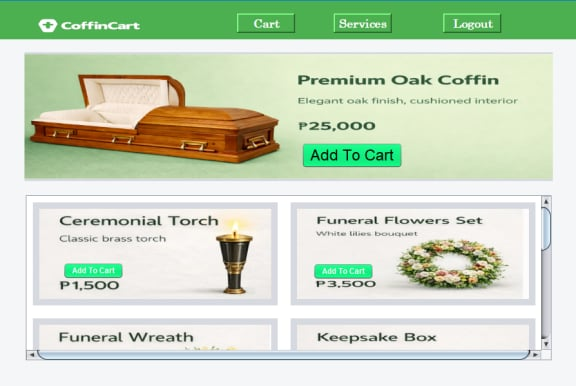

#  CoffinCart
### Funeral Home Management System
Capstone Project — Grade 12

## About
A Java-based point-of-sale and inventory management system 
for funeral homes built with NetBeans and MySQL.

## Technologies Used
- Java (NetBeans IDE)
- MySQL / PHPMyAdmin
- XAMPP

## How to Run
1. Import `coffincart.sql` into PHPMyAdmin
2. Open project in NetBeans
3. Run Main.java

